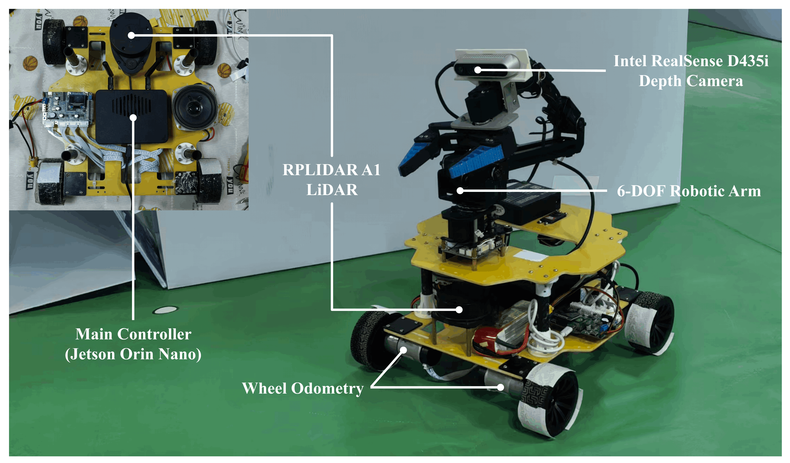
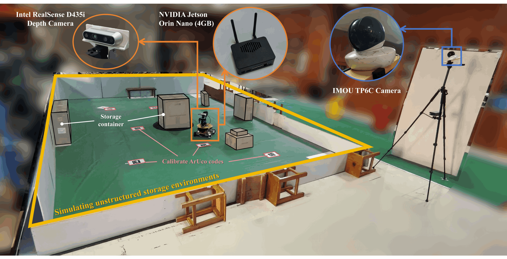
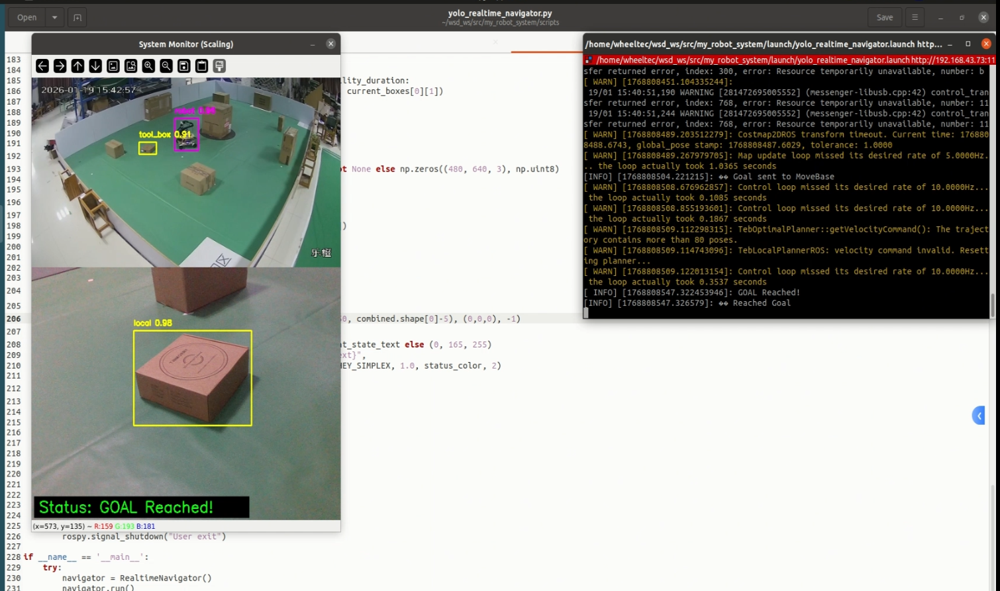

# Vision-CoopNav

A Vision-Based Cooperative Navigation framework for mobile robots in unstructured warehouse environments. The system integrates fixed global cameras with robot-onboard perception via a Finite State Machine (FSM) to address perception discontinuity and occlusion challenges.

## 📦 Installation & Quick Start

1. **Clone the repository**
   ```bash
   git clone https://github.com/IDesigner0/Vision-CoopNav.git
   ```

2. **Build the ROS workspace**
   ```bash
   cd wsd_ws
   catkin_make
   source devel/setup.bash
   ```

3. **Run the cooperative navigator**
   ```bash
   roslaunch my_robot_system yolo_realtime_navigator.launch
   ```
---
## 🛠️ Hardware Configuration

### Mobile Robot Platform
* **Chassis**: Custom-built four-wheel differential drive mobile base.
* **Compute Unit**: NVIDIA Jetson Orin Nano (4GB) as the primary processing unit.
* **Sensors**: 
  * **RPLIDAR A1**: Laser scanner for localization and obstacle avoidance.
  * **Wheel Odometry**: For motion estimation.
  * **Intel RealSense D435i**: Depth camera for local perception and target detection.
* **OS & Framework**: Ubuntu 20.04 with ROS Noetic.
  


### Global Surveillance System
* **Camera**: Dahua Imou TP6C Monocular Camera.
  * **Resolution**: 1280 × 720.
  * **Sensor**: 1/4" CMOS with H.264 video encoding.
* **Deployment**: Fixed at a diagonal position of the workspace via a tripod with a pitch angle of approximately 45°.
* **Communication**: Real-time video streams are transmitted over a wireless network to the edge computing node for YOLO-based detection and Homography-based ground projection.


  
---

### 📺 实验演示视频 (Experimental Demo)

[](wsd_ws/assets/demo_video.mp4)

---

## 🔗 Related Resources

* **jie_ware driver package**:
  * [GitHub](https://github.com/6-robot/jie_ware)
  * [Gitee](https://gitee.com/s-robot/jie_ware)
* **Tutorial Video**:
  * [Bilibili Video](https://www.bilibili.com/video/BV1kwzqYyEe7/)

---
